# 行人检测（Pedestrian Detection）论文整理

@(论文学习记录)[Paper, Pedestrian Detection]

[toc]

## 相关科研工作者
- [Piotr Dollár scholar](https://scholar.google.com/citations?user=a8Y2OJMAAAAJ&hl=zh-CN)
- [Piotr Dollár homepage](https://pdollar.github.io/)
- [张姗姗 scholar](https://scholar.google.com/citations?hl=zh-CN&user=pOSMWfQAAAAJ&view_op=list_works&sortby=pubdate)
- [张姗姗 homepage](https://sites.google.com/site/shanshanzhangshomepage/)
- [欧阳万里 scholar](https://scholar.google.com/citations?user=pw_0Z_UAAAAJ&%20hl=en)
- [欧阳万里 homepage](http://www.ee.cuhk.edu.hk/~wlouyang/)
- [Liu Wei homepage](https://liuwei16.github.io/)

## 开放的代码


- [**lw396285v/CSP-pedestrian-detection-in-pytorch 非官方实现**](https://github.com/lw396285v/CSP-pedestrian-detection-in-pytorch)
[CVPR-2019] High-level Semantic Feature Detection:A New Perspective for Pedestrian Detection [[paper](https://arxiv.org/abs/1904.02948)]

- [**liuwei16/CSP**](https://github.com/liuwei16/CSP)
[CVPR-2019] High-level Semantic Feature Detection:A New Perspective for Pedestrian Detection [[paper](https://arxiv.org/abs/1904.02948)]

- [**liuwei16/ALFNet**](https://github.com/liuwei16/ALFNet)
[ECCV-2018] Learning Efficient Single-stage Pedestrian Detectors by Asymptotic Localization Fitting

- [**rainofmine/Bi-box_Regression 非官方实现**](https://github.com/rainofmine/Bi-box_Regression)
[ECCV-2018] Bi-box Regression for Pedestrian Detection and Occlusion Estimation

- [**rainofmine/Repulsion_Loss 非官方实现**](https://github.com/rainofmine/Repulsion_Loss)
[CVPR-2018] Repulsion Loss: Detecting Pedestrians in a Crowd

- [**garrickbrazil/SDS-RCNN**](https://github.com/garrickbrazil/SDS-RCNN)
[ICCV-2017] Illuminating Pedestrians via Simultaneous Detection & Segmentation

- [**zhangliliang/RPN_BF**](https://github.com/zhangliliang/RPN_BF)
[ECCV-2016] Is Faster R-CNN Doing Well for Pedestrian Detection?

## Paper List

- [TPAMI-2019] EuroCity Persons: A Novel Benchmark for Person Detection in Traffic Scenes [[paper](http://intelligent-vehicles.org/wp-content/uploads/2019/04/braun2019tpami_eurocity_persons.pdf)]
- [CVPR-2019 oral] Adaptive NMS: Refining Pedestrian Detection in a Crowd [[paper](https://arxiv.org/abs/1904.02948)]
- [CVPR-2019] High-level Semantic Feature Detection:A New Perspective for Pedestrian Detection [[paper](https://arxiv.org/abs/1904.02948)] [[**code**](https://github.com/liuwei16/CSP)]
- [CVPR-2019] SSA-CNN: Semantic Self-Attention CNN for Pedestrian Detection
- [CVPR-2019] Pedestrian Detection in Thermal Images using Saliency Maps
- [TIP-2018] Too Far to See? Not Really:- Pedestrian Detection with Scale-Aware Localization Policy
- [ECCV-2018] Bi-box Regression for Pedestrian Detection and Occlusion Estimation [[**code**](https://github.com/rainofmine/Bi-box_Regression)]
- [ECCV-2018] Learning Efficient Single-stage Pedestrian Detectors by Asymptotic Localization Fitting [[**code**](https://github.com/liuwei16/ALFNet)]
- [ECCV-2018] Graininess-Aware Deep Feature Learning for Pedestrian Detection
- [ECCV-2018] Occlusion-aware R-CNN: Detecting Pedestrians in a Crowd
- [ECCV-2018] Small-scale Pedestrian Detection Based on Somatic Topology Localization and Temporal Feature Aggregation
- [CVPR-2018] Improving Occlusion and Hard Negative Handling for Single-Stage Pedestrian Detectors
- [CVPR-2018] Occluded Pedestrian Detection Through Guided Attention in CNNs
- [CVPR-2018] Repulsion Loss: Detecting Pedestrians in a Crowd [[**code**](https://github.com/rainofmine/Repulsion_Loss)]
- [TCSVT-2018] Pushing the Limits of Deep CNNs for Pedestrian Detection
- [Trans Multimedia-2018] Scale-aware Fast R-CNN for Pedestrian Detection
- [TPAMI-2017] Jointly Learning Deep Features, Deformable Parts, Occlusion and Classification for Pedestrian Detection
- [BMVC-2017] PCN: Part and Context Information for Pedestrian Detection with CNNs
- [CVPR-2017] CityPersons: A Diverse Dataset for Pedestrian Detection
- [CVPR-2017] Learning Cross-Modal Deep Representations for Robust Pedestrian Detection
- [CVPR-2017] What Can Help Pedestrian Detection?
- [ICCV-2017] Multi-label Learning of Part Detectors for Heavily Occluded Pedestrian Detection
- [ICCV-2017] Illuminating Pedestrians via Simultaneous Detection & Segmentation [[**code**](https://github.com/garrickbrazil/SDS-RCNN)]
- [TPAMI-2017] Towards Reaching Human Performance in Pedestrian Detection
- [Transactions on Multimedia-2017] Scale-Aware Fast R-CNN for Pedestrian Detection
- [CVPR-2016] Semantic Channels for Fast Pedestrian Detection
- [CVPR-2016] How Far are We from Solving Pedestrian Detection?
- ![CVPR-2016] Pedestrian Detection Inspired by Appearance Constancy and Shape Symmetry
- ![CVPR-2016] Semantic Channels for Fast Pedestrian Detection
- ![ECCV-2016] Is Faster R-CNN Doing Well for Pedestrian Detection? [[**code**](https://github.com/zhangliliang/RPN_BF)]
- [CVPR-2015] Taking a Deeper Look at Pedestrians
- ![ICCV-2015] Learning Complexity-Aware Cascades for Deep Pedestrian Detection
- [ICCV-2015] Deep Learning Strong Parts for Pedestrian Detection
- ![ECCV-2014] Deep Learning of Scene-specific Classifier for Pedestrian Detection
- [CVPR-2013] Joint Deep Learning for Pedestrian Detection
- [CVPR-2012] A Discriminative Deep Model for Pedestrian Detection with Occlusion Handling
- [CVPR-2010] Multi-Cue Pedestrian Classification With Partial Occlusion Handling
- [CVPR-2009] Pedestrian detection: A benchmark
- [CVPR-2008] People-Tracking-by-Detection and People-Detection-by-Tracking
- [ECCV-2006] Human Detection Using Oriented Histograms of Flow and Appearance
- [CVPR-2005] Histograms of Oriented Gradients for Human Detection


## 行人检测开源代码


## 论文

### [CVPR-2019] Adaptive NMS: Refining Pedestrian Detection in a Crowd
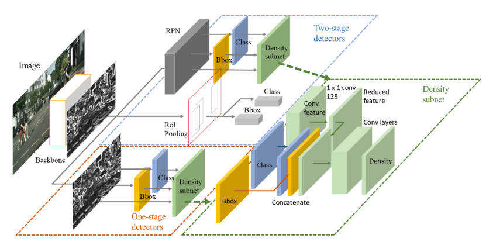
- paper: https://arxiv.org/abs/1904.02948

### [CVPR-2019] High-level Semantic Feature Detection:A New Perspective for Pedestrian Detection


- paper: https://arxiv.org/abs/1904.02948
- github: https://github.com/liuwei16/CSP

### [CVPR-2019] SSA-CNN: Semantic Self-Attention CNN for Pedestrian Detection

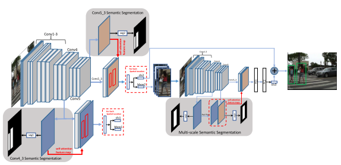
- paper: https://arxiv.org/abs/1902.09080v1

### [CVPR-2019] Pedestrian Detection in Thermal Images using Saliency Maps

- paper: https://arxiv.org/abs/1904.06859


### [TIP-2018] Too Far to See? Not Really:- Pedestrian Detection with Scale-Aware Localization Policy


- arxiv: https://arxiv.org/abs/1709.00235
- paper: https://ieeexplore.ieee.org/document/8328854/
- project website:
- slides:
- github caffe:

### [Transactions on Multimedia-2017] Scale-Aware Fast R-CNN for Pedestrian Detection


- arxiv: https://arxiv.org/abs/1510.08160
- paper: https://ieeexplore.ieee.org/abstract/document/8060595/
- project website:
- slides:
- github caffe:

</br>
</br>

### [ECCV-2018] Bi-box Regression for Pedestrian Detection and Occlusion Estimation
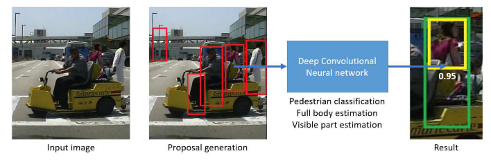
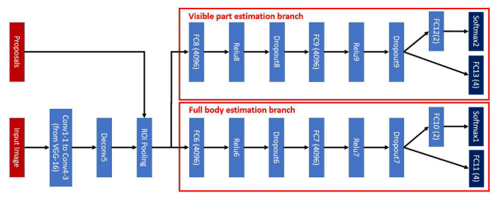

- arxiv:
- paper:http://openaccess.thecvf.com/content_ECCV_2018/papers/CHUNLUAN_ZHOU_Bi-box_Regression_for_ECCV_2018_paper.pdf
- slides:
- github:


### [ECCV-2018] Learning Efficient Single-stage Pedestrian Detectors by Asymptotic Localization Fitting
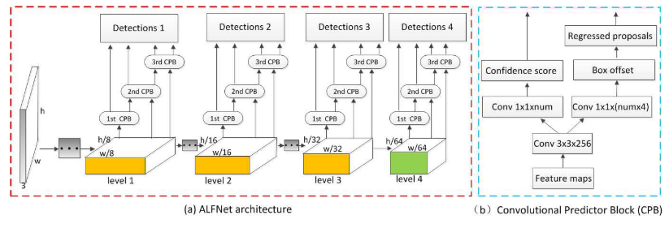

- arxiv:
- paper:http://openaccess.thecvf.com/content_ECCV_2018/papers/Wei_Liu_Learning_Efficient_Single-stage_ECCV_2018_paper.pdf
- project website:
- slides:
- github:

### [ECCV-2018] Graininess-Aware Deep Feature Learning for Pedestrian Detection
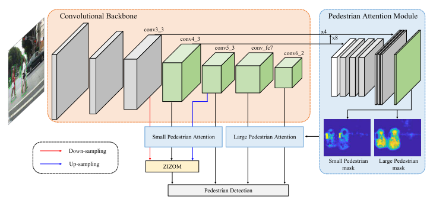

- arxiv:
- paper:http://openaccess.thecvf.com/content_ECCV_2018/papers/Chunze_Lin_Graininess-Aware_Deep_Feature_ECCV_2018_paper.pdf
- project website:
- slides:
- github:

### [ECCV-2018] Occlusion-aware R-CNN: Detecting Pedestrians in a Crowd

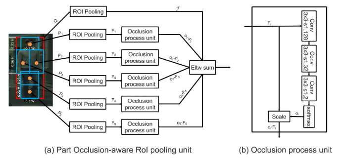

- arxiv: http://arxiv.org/abs/1807.08407


### [ECCV-2018] Small-scale Pedestrian Detection Based on Somatic Topology Localization and Temporal Feature Aggregation


- arxiv:https://arxiv.org/abs/1807.01438
- project website:
- slides:
- github caffe:

</br>
</br>

### [CVPR-2018] Improving Occlusion and Hard Negative Handling for Single-Stage Pedestrian Detectors


- arxiv:
- paper: http://vision.snu.ac.kr/projects/partgridnet/data/noh_2018.pdf
- project website: http://vision.snu.ac.kr/projects/partgridnet/
- slides:
- github caffe:

</br>
</br>


### [CVPR-2018] Occluded Pedestrian Detection Through Guided Attention in CNNs


- arxiv:
- paper: http://openaccess.thecvf.com/content_cvpr_2018/papers/Zhang_Occluded_Pedestrian_Detection_CVPR_2018_paper.pdf
- project website:
- slides:
- github caffe:

</br>
</br>

### [CVPR-2018] Repulsion Loss: Detecting Pedestrians in a Crowd


- arxiv:http://arxiv.org/abs/1711.07752
- project website:
- slides:
- github caffe:

</br>
</br>

### [TPAMI-2017] Jointly Learning Deep Features, Deformable Parts, Occlusion and Classification for Pedestrian Detection


- paper: https://ieeexplore.ieee.org/abstract/document/8008790/
- project website:
- slides:
- github caffe:

</br>
</br>
</br>
</br>
</br>
</br>

### [BMVC-2017] PCN: Part and Context Information for Pedestrian Detection with CNNs
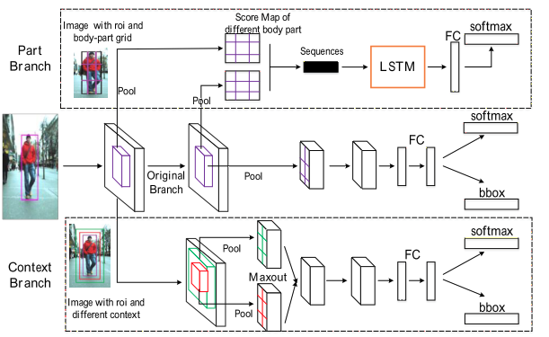

- arxiv: https://arxiv.org/abs/1804.044838
- project website:
- slides:
- github caffe:

</br>
</br>
</br>


### [CVPR-2017] CityPersons: A Diverse Dataset for Pedestrian Detection


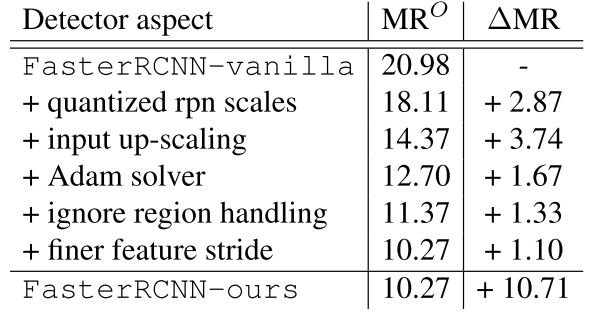


- arxiv: http://arxiv.org/abs/1702.05693
- project website:
- slides:
- github caffe:

</br>
</br>
</br>

---

### [CVPR-2017] Learning Cross-Modal Deep Representations for Robust Pedestrian Detection
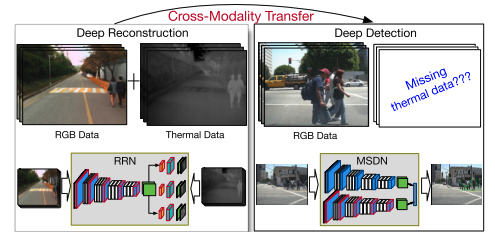

- arxiv: https://arxiv.org/abs/1704.02431
- project website:
- slides:
- github caffe:

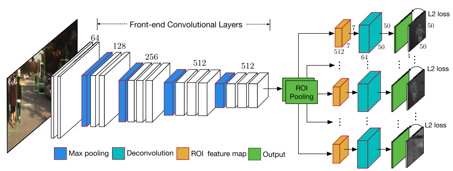


### [CVPR-2017] What Can Help Pedestrian Detection?

- arxiv: https://arxiv.org/abs/1704.02431
- project website:
- slides:
- github caffe:


### [TPAMI-2017] Towards Reaching Human Performance in Pedestrian Detection

- paper: http://ieeexplore.ieee.org/document/7917260/
- arxiv:
- project website:
- slides:
- github caffe:

### [ICCV-2017] Multi-label Learning of Part Detectors for Heavily Occluded Pedestrian Detection
- paper: http://openaccess.thecvf.com/content_ICCV_2017/papers/Zhou_Multi-Label_Learning_of_ICCV_2017_paper.pdf
- arxiv:
- project website:
- slides:

### [ICCV-2017]Illuminating Pedestrians via Simultaneous Detection & Segmentation


- arxiv: https://arxiv.org/abs/1706.08564
- project website: http://cvlab.cse.msu.edu/project-pedestrian-detection.html
- slides:
- github caffe: https://github.com/garrickbrazil/SDS-RCNN


### [CVPR-2016] Semantic Channels for Fast Pedestrian Detection


- paper: https://www.cv-foundation.org/openaccess/content_cvpr_2016/papers/Costea_Semantic_Channels_for_CVPR_2016_paper.pdf
- project website:
- slides:
- github caffe:

### [CVPR-2016] Pedestrian Detection Inspired by Appearance Constancy and Shape Symmetry

- paper: http://openaccess.thecvf.com/content_cvpr_2016/papers/Cao_Pedestrian_Detection_Inspired_CVPR_2016_paper.pdf
- project website:
- slides:

### [CVPR-2016] Semantic Channels for Fast Pedestrian Detection

- paper: http://openaccess.thecvf.com/content_cvpr_2016/papers/Costea_Semantic_Channels_for_CVPR_2016_paper.pdf
- project website:
- slides:

### [ECCV-2016] Is Faster R-CNN Doing Well for Pedestrian Detection?

- paper:
- project website:
- slides:

### [CVPR-2016] How Far are We from Solving Pedestrian Detection?

- paper: https://www.cv-foundation.org/openaccess/content_cvpr_2016/app/S06-29.pdf
- project website:
- slides:
- github caffe:

### [ICCV-2015] Learning Complexity-Aware Cascades for Deep Pedestrian Detection

- paper: http://openaccess.thecvf.com/content_iccv_2015/papers/Cai_Learning_Complexity-Aware_Cascades_ICCV_2015_paper.pdf
- project website:
- slides:


### [ICCV-2015] Deep Learning Strong Parts for Pedestrian Detection


- paper: https://www.cv-foundation.org/openaccess/content_iccv_2015/html/Tian_Deep_Learning_Strong_ICCV_2015_paper.htmler.html
- project website:
- slides:
- github caffe:
</br>


### [CVPR-2013] Joint Deep Learning for Pedestrian Detection Wanli


- paper: https://www.cv-foundation.org/openaccess/content_iccv_2013/html/Ouyang_Joint_Deep_Learning_2013_ICCV_paper.html
- project website:
- slides:
- github caffe:
</br>
</br>
</br>
</br>
</br>

### [CVPR-2012] A Discriminative Deep Model for Pedestrian Detection with Occlusion Handling
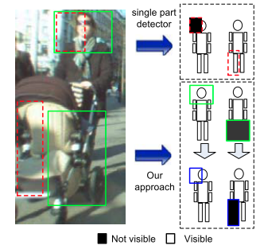

- paper: http://mmlab.ie.cuhk.edu.hk/pdf/ouyangWcvpr2012.pdf
- paper: https://ieeexplore.ieee.org/abstract/document/6248062/
- project website:
- slides:
- github caffe:
</br>
</br>
</br>
</br>
</br>
</br>
</br>

### [CVPR-2010] Multi-Cue Pedestrian Classification With Partial Occlusion Handling
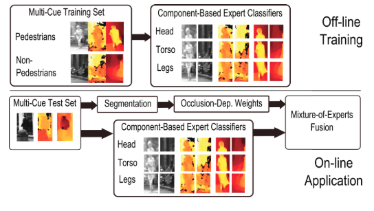

- paper: https://ieeexplore.ieee.org/abstract/document/5540111/
- project website:
- slides:
- github caffe:
</br>
</br>
</br>

## 行人检测数据集

### CityPersons

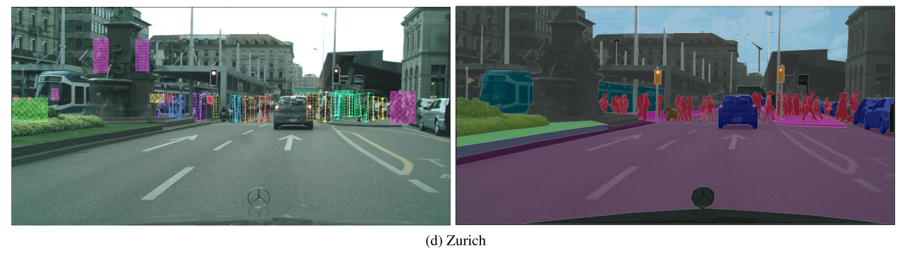


CityPersons数据集是在Cityscapes数据集基础上建立的，使用了Cityscapes数据集的数据，对一些类别进行了精确的标注。该数据集是在[CVPR-2017] CityPersons: A Diverse Dataset for Pedestrian Detection这篇论文中提出的，更多细节可以通过阅读该论文了解。

上图中左侧是行人标注，右侧是原始的CityScapes数据集。

- [**标注和评估文件**](https://bitbucket.org/shanshanzhang/citypersons)
- [**数据集下载**](https://www.cityscapes-dataset.com/)
文件格式

```
#评测文件
$/Cityscapes/shanshanzhang-citypersons/evaluation/eval_script/coco.py
$/Cityscapes/shanshanzhang-citypersons/evaluation/eval_script/eval_demo.py
$/Cityscapes/shanshanzhang-citypersons/evaluation/eval_script/eval_MR_multisetup.py

#注释文件
$/Cityscapes/shanshanzhang-citypersons/annotations
$/Cityscapes/shanshanzhang-citypersons/annotations/anno_train.mat
$/Cityscapes/shanshanzhang-citypersons/annotations/anno_val.mat
$/Cityscapes/shanshanzhang-citypersons/annotations/README.txt
#图片数据

$/Cityscapes/leftImg8bit/train/*
$/Cityscapes/leftImg8bit/val/*
$/Cityscapes/leftImg8bit/test/*
```

注释文件格式
```
CityPersons annotations
(1) data structure:
    one image per cell
    in each cell, there are three fields: city_name; im_name; bbs (bounding box annotations)

(2) bounding box annotation format:
　　 one object instance per row:
　　 [class_label, x1,y1,w,h, instance_id, x1_vis, y1_vis, w_vis, h_vis]

(3) class label definition:
　 class_label =0: ignore regions (fake humans, e.g. people on posters, reflections etc.)
    class_label =1: pedestrians
    class_label =2: riders
    class_label =3: sitting persons
    class_label =4: other persons with unusual postures
    class_label =5: group of people

(4) boxes:
　　visible boxes [x1_vis, y1_vis, w_vis, h_vis] are automatically generated from segmentation masks;
      (x1,y1) is the upper left corner.
      if class_label==1 or 2
        [x1,y1,w,h] is a well-aligned bounding box to the full body ;
      else
        [x1,y1,w,h] = [x1_vis, y1_vis, w_vis, h_vis];
```

### Caltech
- [**Caltech官网**](http://www.vision.caltech.edu/Image_Datasets/CaltechPedestrians/)
更所细节请阅读这篇论文，
[[TAPAMI-2012] Pedestrian Detection: An Evaluation of the State of the Art
](http://www.vision.caltech.edu/Image_Datasets/CaltechPedestrians/files/PAMI12pedestrians.pdf)


### KITTI
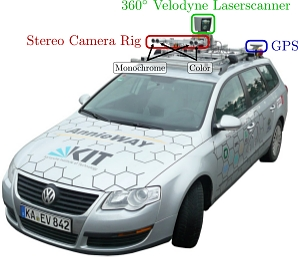

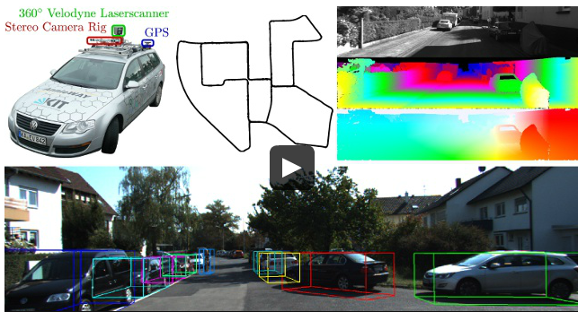

- [**KITTI官网**](http://www.cvlibs.net/datasets/kitti/) 

### EuroCity


[EuroCity 官网](https://eurocity-dataset.tudelft.nl/eval/overview/statistics)

[EuroCity Paper](http://intelligent-vehicles.org/wp-content/uploads/2019/04/braun2019tpami_eurocity_persons.pdf)

- [TPAMI-2019] EuroCity Persons: A Novel Benchmark for Person Detection in Traffic Scenes

With over 238200 person instances manually labeled in over 47300 images, EuroCity Persons is nearly one order of magnitude larger than person datasets used previously for benchmarking. Diversity is gained by recording this dataset throughout Europe.

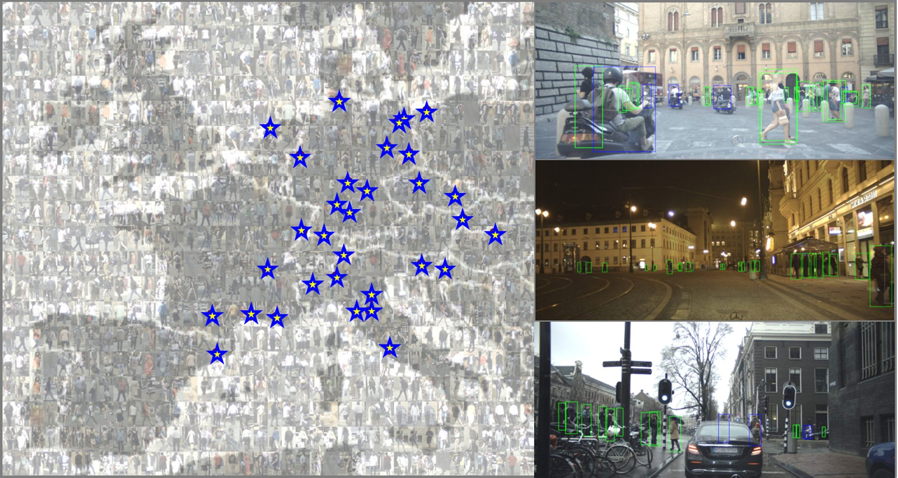

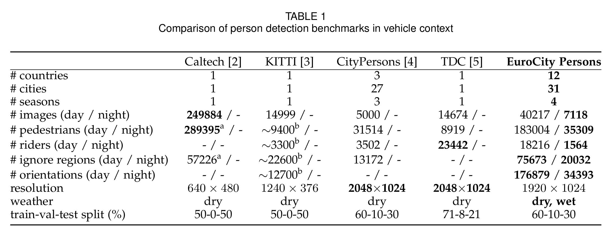


| Object Class | # objects (day) | # objects (night) | # objects (sum) |
|:------------:|:---------------:|:-----------------:|:---------------:|
|  Pedestrian  |     183004      |       35309       |     218313      |
|    Rider     |      18216      |       1564        |      19780      |

### CrowdHuman

[CrowdHuman 主页](http://www.crowdhuman.org/)

[CrowdHuman Paper](https://arxiv.org/abs/1805.00123)

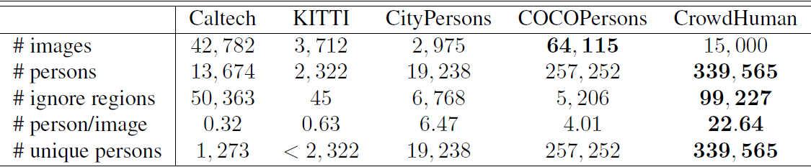

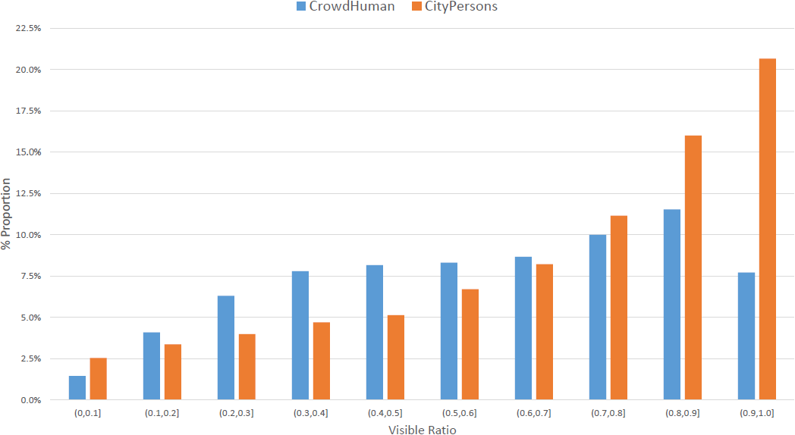

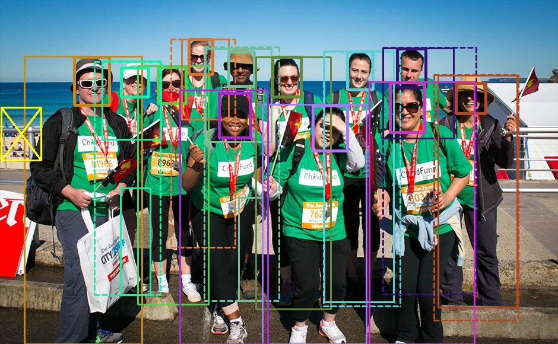

## 性能比较

数据来自 [CityPersons](https://bitbucket.org/shanshanzhang/citypersons/src/default/) 官网。

|       Method       | MR (Reasonable) | MR (Reasonable_small) | MR (Reasonable_occ=heavy) | MR (All) |
|:------------------:|:---------------:|:---------------------:|:-------------------------:|:--------:|
|     YT-PedDet      |      8.41%      |        10.60%         |          37.88%           |  37.22%  |
|       STNet        |      9.78%      |        10.95%         |          36.16%           |  31.36%  |
|       DVRNet       |     10.99%      |        15.68%         |          43.77%           |  41.48%  |
|      HBA-RCNN      |     11.06%      |        14.77%         |          43.61%           |  39.54%  |
|       OR-CNN       |     11.32%      |        14.19%         |          51.43%           |  40.19%  |
|   Repultion Loss   |     11.48%      |        15.67%         |          52.59%           |  39.17%  |
| Adapted FasterRCNN |     12.97%      |        37.24%         |          50.47%           |  43.86%  |
|       MS-CNN       |     13.32%      |        15.86%         |          51.88%           |  39.94%  |
