# 行人检测（Pedestrian Detection）论文整理

@(论文学习记录)[Paper, Pedestrian Detection]

[toc]

## 相关科研工作者
- [张姗姗 scholar](https://scholar.google.com/citations?hl=zh-CN&user=pOSMWfQAAAAJ&view_op=list_works&sortby=pubdate)
- [张姗姗 homepage](https://sites.google.com/site/shanshanzhangshomepage/)

- [欧阳万里 scholar](https://scholar.google.com/citations?user=pw_0Z_UAAAAJ&%20hl=en)
- [欧阳万里 homepage](http://www.ee.cuhk.edu.hk/~wlouyang/)

## 论文


### [TIP-2018] Too Far to See? Not Really:- Pedestrian Detection with Scale-Aware Localization Policy
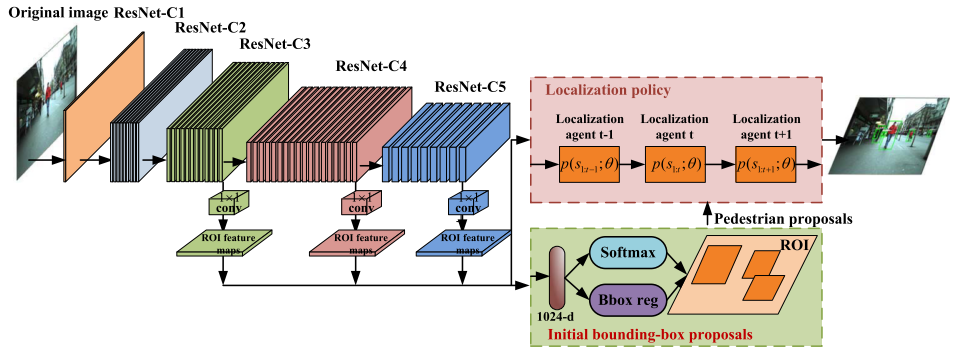
- arxiv: https://arxiv.org/abs/1709.00235
- paper: https://ieeexplore.ieee.org/document/8328854/
- project website: 
- slides: 
- github caffe: 

### [Transactions on Multimedia-2017] Scale-Aware Fast R-CNN for Pedestrian Detection
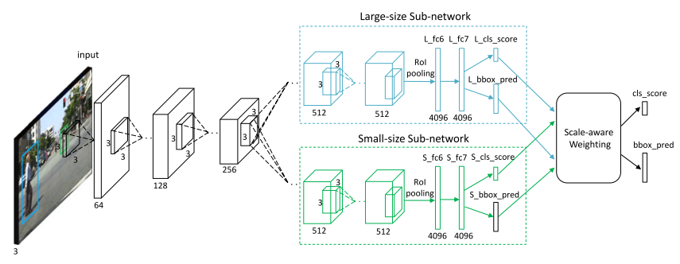

- arxiv: https://arxiv.org/abs/1510.08160
- paper: https://ieeexplore.ieee.org/abstract/document/8060595/
- project website: 
- slides: 
- github caffe: 

</br>
</br>
### [ECCV-2018] Small-scale Pedestrian Detection Based on Somatic Topology Localization and Temporal Feature Aggregation
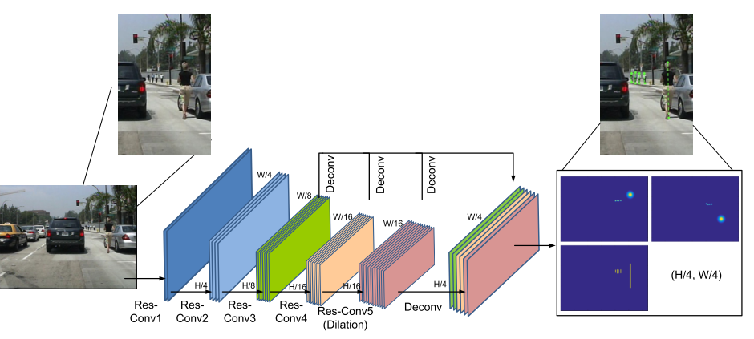

- arxiv:https://arxiv.org/abs/1807.01438
- project website: 
- slides: 
- github caffe: 

</br>
</br>
### [CVPR-2018] Improving Occlusion and Hard Negative Handling for Single-Stage Pedestrian Detectors
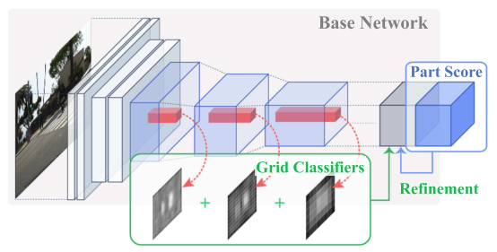

- arxiv:
- paper: http://vision.snu.ac.kr/projects/partgridnet/data/noh_2018.pdf
- project website: http://vision.snu.ac.kr/projects/partgridnet/
- slides: 
- github caffe: 


### [CVPR-2018] Occluded Pedestrian Detection Through Guided Attention in CNNs
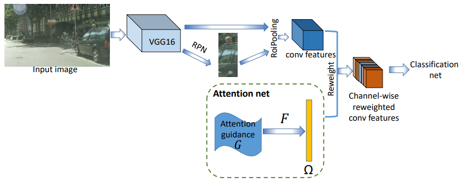

- arxiv:
- paper: http://openaccess.thecvf.com/content_cvpr_2018/papers/Zhang_Occluded_Pedestrian_Detection_CVPR_2018_paper.pdf
- project website: 
- slides: 
- github caffe: 


### [CVPR-2018] Repulsion Loss: Detecting Pedestrians in a Crowd
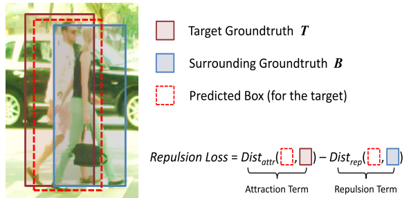

- arxiv:http://arxiv.org/abs/1711.07752
- project website: 
- slides: 
- github caffe: 


### [TPAMI-2017] Jointly Learning Deep Features, Deformable Parts, Occlusion and Classification for Pedestrian Detection
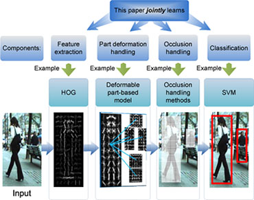

- paper: https://ieeexplore.ieee.org/abstract/document/8008790/
- project website: 
- slides: 
- github caffe: 


### [BMVC-2017] PCN: Part and Context Information for Pedestrian Detection with CNNs


- arxiv: https://arxiv.org/abs/1804.044838
- project website: 
- slides: 
- github caffe: 


### [CVPR-2017] CityPersons: A Diverse Dataset for Pedestrian Detection


- arxiv: http://arxiv.org/abs/1702.05693
- project website: 
- slides: 
- github caffe: 


---

### [CVPR-2017] Learning Cross-Modal Deep Representations for Robust Pedestrian Detection


- arxiv: https://arxiv.org/abs/1704.02431
- project website: 
- slides: 
- github caffe: 

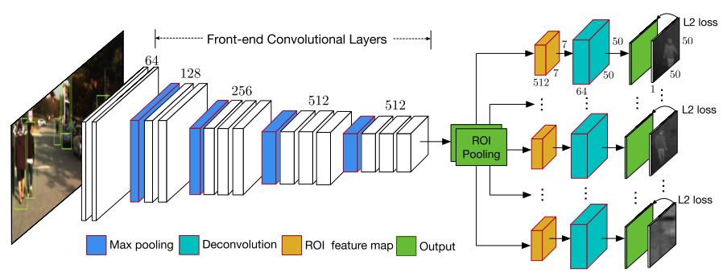
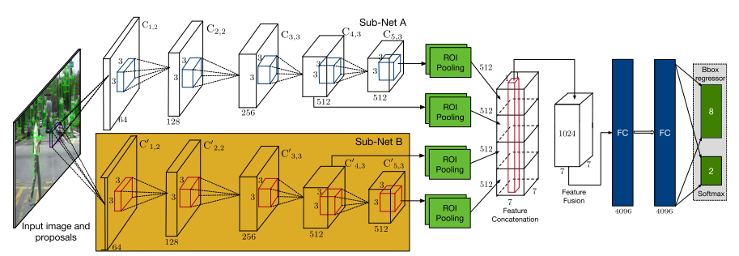


### [CVPR-2017] What Can Help Pedestrian Detection?

- arxiv: https://arxiv.org/abs/1704.02431
- project website: 
- slides: 
- github caffe: 


### [TPAMI-2017] Towards Reaching Human Performance in Pedestrian Detection

- paper: http://ieeexplore.ieee.org/document/7917260/
- arxiv: 
- project website: 
- slides: 
- github caffe: 

### [ICCV-2017] Multi-label Learning of Part Detectors for Heavily Occluded Pedestrian Detection
- paper: http://openaccess.thecvf.com/content_ICCV_2017/papers/Zhou_Multi-Label_Learning_of_ICCV_2017_paper.pdf
- arxiv: 
- project website: 
- slides: 

### [ICCV-2017]Illuminating Pedestrians via Simultaneous Detection & Segmentation


- arxiv: https://arxiv.org/abs/1706.08564
- project website: http://cvlab.cse.msu.edu/project-pedestrian-detection.html
- slides: 
- github caffe: https://github.com/garrickbrazil/SDS-RCNN


### [CVPR-2016] Semantic Channels for Fast Pedestrian Detection
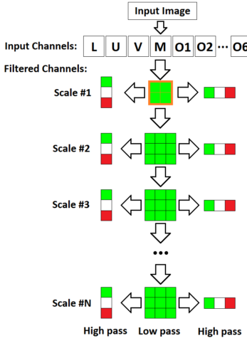

- paper: https://www.cv-foundation.org/openaccess/content_cvpr_2016/papers/Costea_Semantic_Channels_for_CVPR_2016_paper.pdf
- project website: 
- slides: 
- github caffe: 


### [CVPR-2016] How Far areWe from Solving Pedestrian Detection?

- paper: https://www.cv-foundation.org/openaccess/content_cvpr_2016/app/S06-29.pdf
- project website: 
- slides: 
- github caffe: 

### [ICCV-2015] Deep Learning Strong Parts for Pedestrian Detection
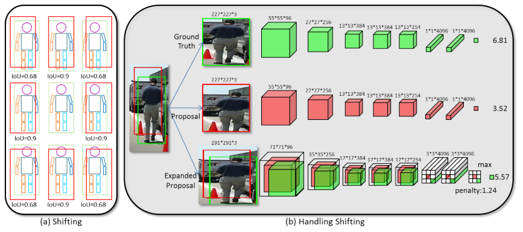

- paper: https://www.cv-foundation.org/openaccess/content_iccv_2015/html/Tian_Deep_Learning_Strong_ICCV_2015_paper.htmler.html
- project website: 
- slides: 
- github caffe: 
</br>


### [CVPR-2013] Joint Deep Learning for Pedestrian Detection Wanli
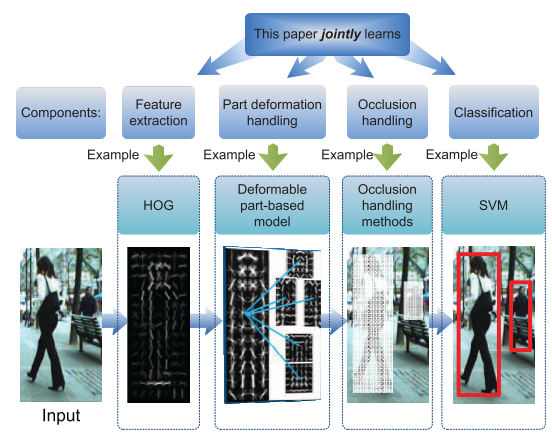

- paper: https://www.cv-foundation.org/openaccess/content_iccv_2013/html/Ouyang_Joint_Deep_Learning_2013_ICCV_paper.html
- project website: 
- slides: 
- github caffe: 


### [CVPR-2012] A Discriminative Deep Model for Pedestrian Detection with Occlusion Handling
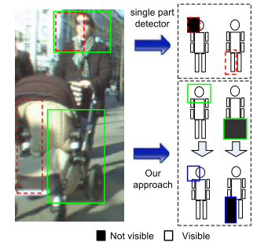

- paper: http://mmlab.ie.cuhk.edu.hk/pdf/ouyangWcvpr2012.pdf
- paper: https://ieeexplore.ieee.org/abstract/document/6248062/
- project website: 
- slides: 
- github caffe: 
</br>


### [CVPR-2010] Multi-Cue Pedestrian Classification With Partial Occlusion Handling


- paper: https://ieeexplore.ieee.org/abstract/document/5540111/
- project website: 
- slides: 
- github caffe: 


## 行人检测数据集

### CityPersons

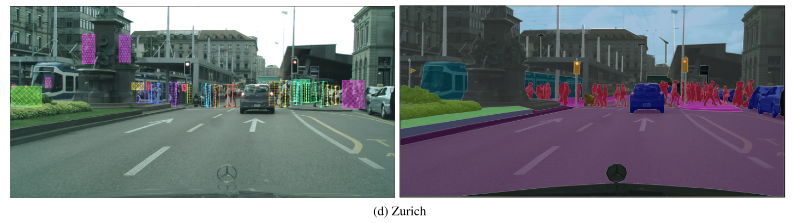


CityPersons数据集是在Cityscapes数据集基础上建立的，使用了Cityscapes数据集的数据，对一些类别进行了精确的标注。该数据集是在[CVPR-2017] CityPersons: A Diverse Dataset for Pedestrian Detection这篇论文中提出的，更多细节可以通过阅读该论文了解。

上图中左侧是行人标注，右侧是原始的CityScapes数据集。

- [**标注和评估文件**](https://bitbucket.org/shanshanzhang/citypersons)
- [**数据集下载**](https://www.cityscapes-dataset.com/)
文件格式

```
#评测文件
$/Cityscapes/shanshanzhang-citypersons/evaluation/eval_script/coco.py
$/Cityscapes/shanshanzhang-citypersons/evaluation/eval_script/eval_demo.py
$/Cityscapes/shanshanzhang-citypersons/evaluation/eval_script/eval_MR_multisetup.py

#注释文件
$/Cityscapes/shanshanzhang-citypersons/annotations
$/Cityscapes/shanshanzhang-citypersons/annotations/anno_train.mat
$/Cityscapes/shanshanzhang-citypersons/annotations/anno_val.mat
$/Cityscapes/shanshanzhang-citypersons/annotations/README.txt
#图片数据

$/Cityscapes/leftImg8bit/train/*
$/Cityscapes/leftImg8bit/val/*
$/Cityscapes/leftImg8bit/test/*
```

注释文件格式
```
CityPersons annotations
(1) data structure: 
    one image per cell
    in each cell, there are three fields: city_name; im_name; bbs (bounding box annotations)

(2) bounding box annotation format:
　　 one object instance per row:
　　 [class_label, x1,y1,w,h, instance_id, x1_vis, y1_vis, w_vis, h_vis]

(3) class label definition:
　 class_label =0: ignore regions (fake humans, e.g. people on posters, reflections etc.)
    class_label =1: pedestrians
    class_label =2: riders
    class_label =3: sitting persons
    class_label =4: other persons with unusual postures
    class_label =5: group of people

(4) boxes:
　　visible boxes [x1_vis, y1_vis, w_vis, h_vis] are automatically generated from segmentation masks; 
      (x1,y1) is the upper left corner.
      if class_label==1 or 2
        [x1,y1,w,h] is a well-aligned bounding box to the full body ;
      else
        [x1,y1,w,h] = [x1_vis, y1_vis, w_vis, h_vis];
```

### Caltech
- [**Caltech官网**](http://www.vision.caltech.edu/Image_Datasets/CaltechPedestrians/)
更所细节请阅读这篇论文，
[[TAPAMI-2012] Pedestrian Detection: An Evaluation of the State of the Art
](http://www.vision.caltech.edu/Image_Datasets/CaltechPedestrians/files/PAMI12pedestrians.pdf)

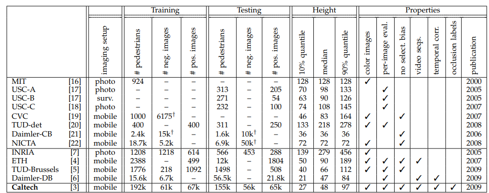


### KITTI


- [**KITTI官网**](http://www.cvlibs.net/datasets/kitti/)
